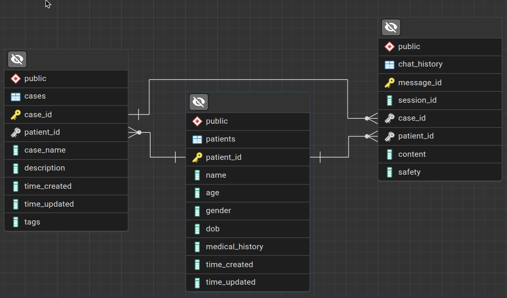

# FastAPI backend for Qwen 3 4B Finetuned model

## Overview

This repository powers a Qwen 3 4B Mental Health Chatbot using a FastAPI backend, offering REST APIs for conversational, empathetic mental health support with a finetuned language model. The system is built for scalability, monitoring, and easy integration.

## Features

- Mental Health Support (chat interface, prompt interpretation)
- Persistence (user conversations and predictions stored in a database)
- Extensible (additional endpoints or integrations via FastAPI possible)
- Monitoring & Logging via Pydantic Logfire and Opentelemetry
- Modern API documentation via OpenAPI/Swagger

### Database Schema

This is the database schema for the application.

## API Routes

Below is a Markdown table summarizing all the principal API routes. This format should be adapted with specifics as more detailed endpoints are added to the repo.

| Route      | Method | Description                                  | Request Body               | Response Body          | Usage                 |
| ---------- | ------ | -------------------------------------------- | -------------------------- | ---------------------- | --------------------- |
| `/`        | GET    | Welcome message / API Info                   | None                       | JSON: message          | Health check, docs    |
| `/prompt`  | POST   | Submit a user prompt (chat input)            | `{ prompt: str }`          | `{ response: str}`     | Main chatbot endpoint |
| `/history` | GET    | Retrieve conversation history                | Query params: user/session | Array of conversations | Display past chats    |
| `/predict` | POST   | Run mental health prediction (if ML enabled) | `{ data: dict }`           | `{ prediction: str}`   | ML-based assessment   |
| `/monitor` | GET    | System and API usage metrics                 | None                       | Usage stats            | Internal monitoring   |
